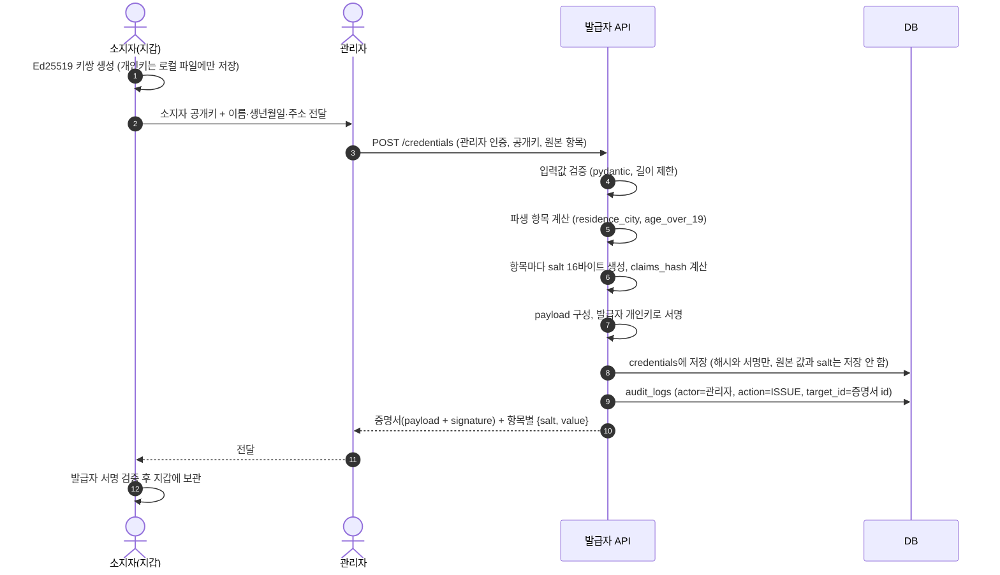
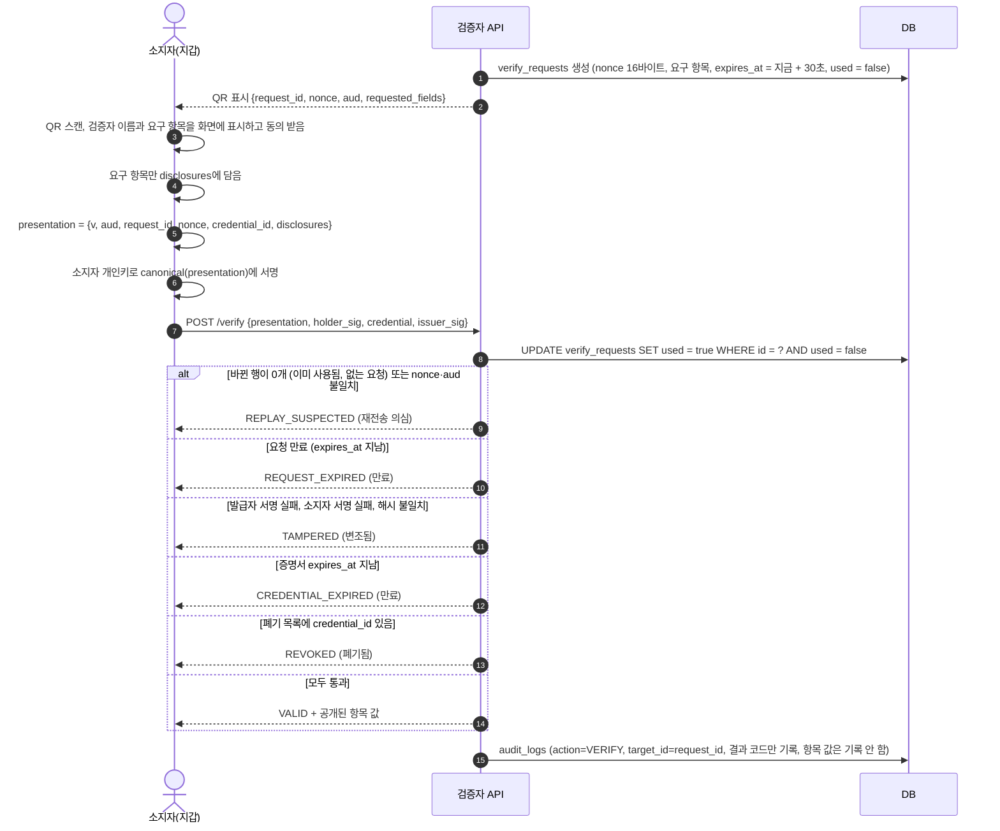
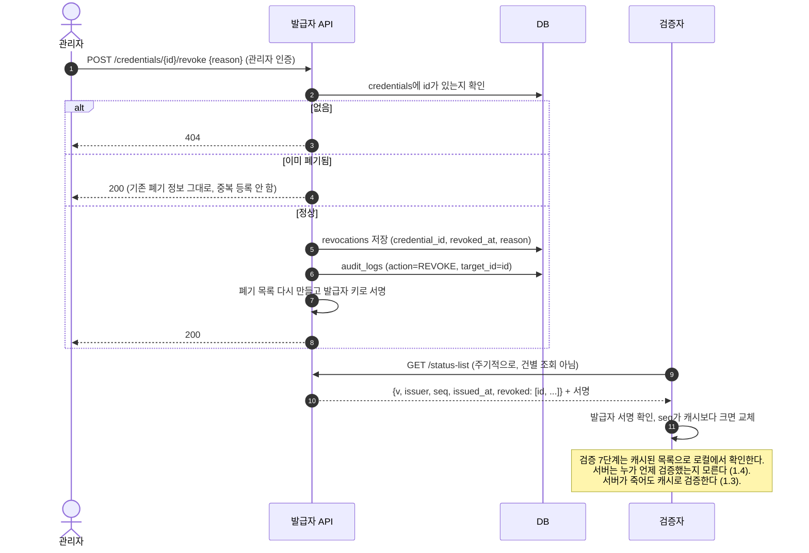

# 설계 문서

## 1. 문제 정의

### 1.1 캡처한 QR/화면을 재사용할 수 있다
- 상황: 소지자가 신분증 QR이나 화면을 보여주면, 누군가 그걸 캡처해 둘 수 있다.
- 문제: 캡처본을 나중에 다시 내밀면 본인인 척할 수 있다 (재전송 공격).
- 내 보완: 검증자가 매번 1회용 값(nonce, 30초 유효)을 주고, 소지자가 자기 개인키로 거기에 서명해서 낸다. 캡처해도 nonce가 다르니 재사용이 안 된다.

### 1.2 검증자가 필요 이상의 정보를 가져간다
- 상황: 술을 살 때 필요한 건 "성인이다"뿐인데, 화면에 이름·생년월일·주소가 다 보인다.
- 문제: 필요 없는 개인정보가 검증자에게 넘어간다.
- 내 보완: 검증자가 요구한 항목만 소지자가 골라서 공개한다 (선택적 공개).

### 1.3 서버가 죽으면 검증이 안 된다 (선택 목표)
- 상황: 검증 서버 장애가 나면 현장에서 검증 자체가 불가능하다. (2025.9 지역상품권 앱 장애로 QR 결제가 전면 중단된 사례가 있다.)
- 문제: 서버에 의존하는 구조는 가용성이 약하다.
- 내 보완: 서명된 폐기 목록을 미리 내려받아 두면 서버 없이도 검증한다.

### 1.4 폐기 조회 때 서버가 검증 이력을 알게 된다 (선택 목표)
- 상황: "이 증명서 폐기됐나요?"를 건별로 서버에 물어본다.
- 문제: 서버가 누가 언제 어디서 검증받았는지 알 수 있다.
- 내 보완: 폐기 목록을 통째로 받아 로컬에서 확인한다.

## 2. 역할과 행동

| 역할   | 하는 일                                | 갖고 있는 것          | 하면 안 되는 일                     |
|--------|----------------------------------------|----------------------|------------------------------------|
| 발급자 | 증명서 발급, 폐기                       | 발급자 개인키         | 소지자 개인키를 알면 안 됨           |
| 소지자 | 증명서 보관, 요청 항목만 골라 제출       | 소지자 개인키, 증명서 | 서명값을 위조하면 안 됨              |
| 검증자 | 요청 생성(nonce, 요구 항목), 제출물 검증 | 발급자 공개키         | 요구하지 않은 항목을 볼 수 없어야 함 |

## 3. 핵심 기능 4개

| 기능            | 입력                                | 출력                                       |
|-----------------|-------------------------------------|-------------------------------------------|
| 발급            | 이름, 생년월일, 거주지, 소지자 공개키 | 발급자 서명이 붙은 증명서                   |
| 선택적 공개 제출 | 검증자의 요청(nonce, 요구 항목)      | 요구 항목만 담고 nonce에 서명한 제출물      |
| 검증            | 제출물                               | 유효 / 변조됨 / 폐기됨 / 만료 / 재전송 의심 |
| 폐기            | 증명서 ID                            | 폐기 목록에 등록                           |

응용 시나리오(3주차, 경량): 정책지원금 상품권 지급. 위 4개 기능 위에 얹는다.

## 4. 안 만들 것 (이유)

- UI/모바일 앱/소셜 로그인: 핵심이 아니라서
- 블록체인 자체 구현: (내 말로 채우기)
- 실제 결제망·모바일 신분증 연동: 승인 절차가 필요하고 실제 서비스를 건드리면 안 되므로
- 영지식증명(ZKP): 범위를 넘어서서 개선 방향으로만 언급

## 5. 흐름 (시퀀스 다이어그램)

표기 규칙
- 키는 모두 Ed25519. 공개키·서명·salt는 base64url(패딩 없음) 문자열로 주고받는다.
- `canonical(x)`는 정렬된 JSON 직렬화를 뜻한다. 정의는 6.1을 본다.
- 소지자 개인키는 **지갑 쪽(소지자 로컬 파일)에만** 있고, 서버로 보내지 않는다.

### 5.1 발급



설계 포인트
- **원본 값과 salt는 발급 응답으로 한 번만 소지자에게 준다.** 서버에는 해시만 남는다. DB가 유출돼도 개인정보 원문이 나가지 않는다.
- **`age_over_19`, `residence_city` 같은 파생 항목을 발급자가 미리 만들어 둔다.** 성인 확인 때마다 생년월일 전체를 공개하면 과다 수집(1.2)을 막을 수 없기 때문이다.
- 소지자가 공개키에 맞는 개인키를 실제로 갖고 있는지는 확인하지 않는다(소유 증명 생략). 3주차 개선 후보로 남긴다.

### 5.2 검증 (요청 → 제출 → 검증)



검증 순서 (위에서부터 처음 실패한 곳의 결과를 돌려준다)

| 순서 | 확인 내용 | 실패 시 결과 | 이 순서인 이유 |
|---|---|---|---|
| 0 | 형식 검사 (pydantic) | 400 형식 오류 | 이상한 입력은 DB를 건드리기 전에 막는다 |
| 1 | request_id 조회 후 원자적으로 `used=true` 처리, nonce·aud 일치 | REPLAY_SUSPECTED | **가장 먼저 소모해야** 같은 제출물을 동시에 두 번 보내는 경쟁 상태에서도 한 번만 통과한다. 이후 검사에서 실패해도 nonce는 이미 소모된 상태로 둔다 |
| 2 | 요청 `expires_at` > 지금 | REQUEST_EXPIRED | 30초 안에 낸 제출만 받는다 |
| 3 | 발급자 공개키로 `issuer_sig` 검증 | TAMPERED | 증명서가 진짜인지 확인한다 |
| 4 | `credential.id == presentation.credential_id` 확인 후 `credential.holder_pubkey`로 `holder_sig` 검증 | TAMPERED | 남의 증명서를 가져와 낸 것이 아님을 확인한다 (소지자 바인딩) |
| 5 | 공개 항목 집합 == 요구 항목 집합, 각 항목의 `H(salt, 항목명, 값)`이 `claims_hash`와 일치 | TAMPERED | 값 변조를 막고, 요구하지 않은 항목은 받지 않는다 |
| 6 | 증명서 `expires_at` > 지금 | CREDENTIAL_EXPIRED | 서명이 유효해도 기간이 지난 증명서는 거부한다 |
| 7 | 폐기 목록에 없음 | REVOKED | 서명이 유효해도 폐기된 증명서는 거부한다 ("서명은 유효하지만 폐기됨") |

화면에 보이는 결과 5종과 결과 코드의 대응: 유효=VALID, 변조됨=TAMPERED, 폐기됨=REVOKED, 만료=REQUEST_EXPIRED 또는 CREDENTIAL_EXPIRED, 재전송 의심=REPLAY_SUSPECTED.

### 5.3 폐기



설계 포인트
- **폐기 목록에도 발급자 서명을 붙인다.** 서명이 없으면 중간에서 목록을 바꿔치기해 폐기된 증명서를 살릴 수 있다.
- **`seq`(순번)를 둔다.** 공격자가 예전(폐기 전) 목록을 다시 내미는 롤백을 막는다. 캐시보다 작은 seq는 받지 않는다.
- 폐기 목록이 증명서 id를 그대로 드러내는 건 이 프로젝트의 한계로 둔다. 개선 방향은 비트열 방식 상태 목록이다(README 한계 항목 후보).

## 6. 서명 대상 payload

### 6.1 공통 규칙

| 항목 | 규칙 | 이유 |
|---|---|---|
| 직렬화 | `json.dumps(x, sort_keys=True, separators=(",", ":"), ensure_ascii=False).encode("utf-8")` | 키 순서·공백이 달라지면 같은 내용도 바이트가 달라져 서명 검증이 깨진다. 서명하는 쪽과 검증하는 쪽이 같은 바이트를 만들어야 한다 |
| 시간 | UTC, 초 단위 ISO 8601, `Z` 접미사 (`2026-10-06T03:00:00Z`) | 시간대와 소수점 표기 차이로 직렬화가 달라지는 걸 막는다 |
| 바이트 값 | base64url, 패딩 없음 | JSON과 QR에 그대로 넣을 수 있다 |
| 버전 | 모든 payload에 `"v": 1` | 나중에 필드가 바뀌어도 구버전을 구분할 수 있다 |
| 서명 | Ed25519, `signature = sign(sk, canonical(payload))` | 서명은 payload 밖에 둔다 (자기 자신을 서명할 수 없으므로) |

항목 해시
```
H(salt, 항목명, 값) = base64url( SHA-256( canonical([salt, 항목명, 값]) ) )
```
- **salt**: 항목마다 `secrets.token_bytes(16)`. salt가 없으면 `"대전"`처럼 경우의 수가 적은 값은 해시만 보고 사전 대입으로 맞힐 수 있다.
- **항목명 포함**: 같은 값을 가진 다른 항목의 해시로 바꿔치기하지 못하게 한다.
- **배열로 묶어 직렬화**: `salt + 값`처럼 문자열을 그냥 이어 붙이면 경계가 모호해진다(`"ab"+"c"`와 `"a"+"bc"`가 같아짐).

### 6.2 증명서 payload (VC, 발급자가 서명)

| 필드 | 타입 | 설명 | ERD 컬럼 |
|---|---|---|---|
| `v` | int | 형식 버전, 1 | (추가 제안, 아래 7 참고) |
| `id` | string | `cred_` + uuid4 | `credentials.id` |
| `issuer` | string | 발급자 식별자 (`issuer-demo`) | `credentials.issuer_id` |
| `holder_pubkey` | string | 소지자 Ed25519 공개키 32바이트 | `credentials.holder_pubkey` |
| `claims_hash` | object | 항목명 → `H(salt, 항목명, 값)` | `credentials.claims_hash` |
| `issued_at` | string | 발급 시각 | `credentials.issued_at` |
| `expires_at` | string | 만료 시각 (발급 + 1년) | `credentials.expires_at` |

발급자 서명 → `credentials.signature`

항목 (claims_hash의 키)

| 항목명 | 예시 값 | 쓰이는 곳 |
|---|---|---|
| `name` | `"홍길동"` | 본인 확인 |
| `birth_date` | `"2001-03-15"` | 필요할 때만 |
| `address` | `"대전광역시 유성구 대학로 99"` | 필요할 때만 |
| `residence_city` | `"대전"` | 상품권 자격 (3주차) |
| `age_over_19` | `true` | 성인 확인, 상품권 자격 |

> `age_over_19`는 발급 시점 기준이다. 발급 뒤에 만 19세가 되는 사람은 값이 `false`로 남는다(반대 방향, 즉 미성년자가 성인으로 통과하는 일은 생기지 않는다). 재발급으로 해결하고 한계로 적어 둔다.

### 6.3 제출물 (VP, 소지자가 서명)

| 필드 | 타입 | 설명 |
|---|---|---|
| `v` | int | 1 |
| `aud` | string | 검증자 식별자 (QR에서 받은 값). 다른 검증자에게 그대로 넘겨 쓰지 못하게 한다 |
| `request_id` | string | `verify_requests.id` |
| `nonce` | string | 검증자가 준 1회용 값, 16바이트 |
| `credential_id` | string | 제출하는 증명서 id |
| `disclosures` | object | 요구 항목명 → `{salt, value}` |

**소지자 서명 범위에 `disclosures`까지 넣는다.** nonce만 서명하면 중간에서 공개 항목 값을 갈아 끼워도 소지자 서명이 깨지지 않는다.

전송 형태: `POST /verify`
```
{ "presentation": {...6.3...}, "holder_sig": "...",
  "credential":   {...6.2...}, "issuer_sig": "..." }
```

### 6.4 예시 (실제로 서명·검증해 본 값)

테스트용 고정 키로 만든 값이다(발급자 개인키 = 0x01 32바이트, 소지자 개인키 = 0x02 32바이트). 2주차 2일차 단위 테스트의 기대값으로 그대로 쓸 수 있다. **이 키는 실습 예시 전용이며 실제로 쓰면 안 된다.**

발급자 공개키: `iojj3XQJ8ZX9UtstPLpdcspnCb8dlBIb83SIAbQPb1w`

```json
{
  "credential": {
    "v": 1,
    "id": "cred_3f2b8c1e-7a4d-4e2a-9b1f-0c6d5e4a3b21",
    "issuer": "issuer-demo",
    "holder_pubkey": "gTl3Dqh9F19Wo1Rmw0x-zMuNipG07jeiXfYPW4_Js5Q",
    "claims_hash": {
      "name": "_mabGdvEGHg1VJviwSrYscqyeC634u9zZgslM2uK980",
      "birth_date": "Dvpf0VbfKAjjZiYULgLTW41O7A-WmIKwcpZSajjTJA0",
      "address": "3KLZpeul6ugcZKGd9xm4gwsbzEmfX7sLBzrh5yZw2Gk",
      "residence_city": "FIjvkcA9bEIOgwhLTSytem_qDyqcpK-TTpFpow3sZJ8",
      "age_over_19": "qkZKZnEsRJdHh4j6uvnmm__rNfysH3mUD44AZAphdv0"
    },
    "issued_at": "2026-10-06T03:00:00Z",
    "expires_at": "2027-10-06T03:00:00Z"
  },
  "issuer_sig": "Z9MpDQARN0CBEEaGxN6Gs5rgpl7x9m1ASim_kL-Hl_jOSEOcTHNv0Tlhl_7nzHgjCr_ZDFtHEQS8S2caSvdMBA",
  "presentation": {
    "v": 1,
    "aud": "verifier-demo",
    "request_id": "req_9a1c",
    "nonce": "Qm2xV8tR0pLk4sYw",
    "credential_id": "cred_3f2b8c1e-7a4d-4e2a-9b1f-0c6d5e4a3b21",
    "disclosures": {
      "residence_city": { "salt": "k8rgqh8fRz6V2rJ6cVihHA", "value": "대전" },
      "age_over_19":    { "salt": "rssvROaDf3eUPlJTJsUVIA", "value": true }
    }
  },
  "holder_sig": "ntETLMajY10Zxj0XedCw-PStGxGRFUUKbxIW-4Gj57zh44N1LzylZJ1-8dG_r0qpRsPLiIrcldAjAGPHr_fbDQ"
}
```

확인한 것: 발급자 서명 검증 통과, 공개한 두 항목의 해시가 `claims_hash`와 일치, `expires_at`을 한 글자 바꾸면 `InvalidSignature`.
(예시의 `nonce`, `request_id`는 읽기 쉽게 줄인 값이다. 실제로는 `secrets.token_urlsafe(16)`을 쓴다.)

## 7. 4일차에 발견한 ERD 수정 사항 (research.md 반영)

| # | 현재 | 수정 제안 | 이유 |
|---|---|---|---|
| 1 | `CREDENTIALS \|\|--o{ REVOCATIONS` (1:N) | `CREDENTIALS \|\|--o\| REVOCATIONS` (1:0..1) | `revocations`의 PK가 `credential_id`라서 한 증명서는 최대 한 번만 폐기된다. 3일차 devlog에서 막혔던 관계는 이걸로 정리된다 |
| 2 | `verify_requests`에 증명서 연결 컬럼 없음 | `credential_id`(nullable, 제출 시 채움), `verifier_id`, `result` 추가 | ERD에 credentials–verify_requests 관계가 있는데 연결할 컬럼이 없다. 요청 생성 시점엔 어떤 증명서가 올지 모르므로 nullable로 둔다 |
| 3 | `audit_logs`가 `verify_requests`하고만 연결 | 관계선 제거, `target_type`(credential / verify_request) 컬럼 추가 | 발급·폐기 로그는 증명서를 가리킨다. `target_id` 하나로 두 테이블을 가리키니 FK 대신 타입 컬럼으로 구분한다 |
| 4 | `credentials`에 형식 버전 없음 | `v`(int) 추가 | 6.1의 버전 규칙 |
| 5 | 새 테이블 | `status_lists`(seq PK, payload json, signature, issued_at) | 5.3의 서명된 폐기 목록과 롤백 방지 seq 보관 |

**research.md의 차이표도 고쳐야 한다.** "키 저장 위치: 서버 DB"는 design.md 2절의 "발급자는 소지자 개인키를 알면 안 됨"과 충돌한다. 다음처럼 바꾸는 것을 제안한다.

| 항목 | 실제 모바일 신분증 | 내 구현 (단순화) |
|---|---|---|
| 키 저장 위치 | 폰 보안 영역(TEE/eSE) | 소지자 로컬 파일 (지갑 스크립트). 서버로 보내지 않음. 보안 영역이 없다는 점을 README 한계에 명시 |

## 8. 위협 모델

### 8.1 전제

- **지킬 것(자산)**: 발급자 개인키, 소지자 개인키, 개인정보 원문, 검증 결과의 신뢰성, 상품권(3주차)
- **공격자가 할 수 있는 것**: 네트워크를 엿보고 가로채기, 화면·QR 캡처, 모든 API를 마음대로 호출, 남의 증명서 파일 입수
- **범위 밖 (README 한계에 적기)**: 소지자 기기 자체의 탈취나 악성 앱, 대규모 DDoS, 실제 서비스 공격

### 8.2 위협 표

| # | 위협 | 공격 방법 | 대응 | 근거 절 / 구현 시점 | 남는 위험 |
|---|---|---|---|---|---|
| T1 | 위조 | 가짜 증명서를 만들어 제출 | 발급자 서명 검증. 발급자 공개키는 서버에 파일로 고정하고, 제출물 안에 들어 있는 공개키는 믿지 않음 | 5.2 3단계 / 2주차 2·4일 | 발급자 키가 안전하면 없음 |
| T2 | 변조 | 증명서의 `expires_at`·해시를 고치거나, 공개 값을 바꿔 냄 ("서울"을 "대전"으로) | 발급자 서명(3단계), 해시 비교(5단계), 소지자 서명 범위에 `disclosures` 포함(4단계) | 5.2, 6.3 / 2주차 2·4일 | 없음 |
| T3 | 캡처 재전송 | 남의 제출물을 캡처해서 다시 보냄 | 검증자가 만든 1회용 nonce, `used` 원자적 처리, TTL 30초 | 5.2 1·2단계 / 2주차 4일 | 없음. **3주차 vuln 실습 대상** |
| T4 | 동시 제출 | 같은 제출물을 동시에 두 번 보내 둘 다 통과시킴 | `UPDATE ... WHERE used = false`의 바뀐 행 수로 한 번만 통과 | 5.2 1단계 / 2주차 4일 | 없음 |
| T5 | 실시간 중계 | 다른 검증자의 QR을 피해자에게 보여주고, 피해자가 서명한 제출물을 30초 안에 넘김 | 지갑에 `aud`(검증자 이름)를 크게 표시하고 동의받기, 짧은 TTL | 5.2 3번 / 2주차 6일 | **완전히 못 막음.** 실제 서비스는 BLE/NFC 근접 조건으로 완화함. 한계로 적기 |
| T6 | 남의 증명서 사용 | 친구 증명서 파일을 받아서 제출 | 증명서에 `holder_pubkey` 묶기, 제출 시 소지자 개인키 서명 필요 | 5.2 4단계 / 2주차 3·4일 | 개인키 파일까지 넘겨받으면 못 막음. 실제는 보안 영역 + 생체 인증. 한계로 적기 |
| T7 | 폐기 후 재사용 | 폐기된 증명서를 계속 씀 | 서명된 폐기 목록 확인 (7단계) | 5.3 / 2주차 5일 | 검증자 캐시 갱신 주기만큼 늦게 반영됨. 갱신 주기(예: 5분)를 정하고, 목록이 너무 오래되면 경고 |
| T8 | 폐기 목록 조작 | 목록을 바꿔치기하거나 폐기 전 옛 목록을 다시 내밂 | 목록에 발급자 서명, `seq`가 캐시보다 작으면 거부 | 5.3 / 2주차 5일 | 없음 |
| T9 | 발급자 키 유출 | `.env`나 키 파일이 저장소에 올라감 | `.gitignore`에 `.env`, `*.pem`, `*.key` 확인됨. 배포 전 git 기록 전체 확인 | 4주차 2일 | 유출되면 키 교체 후 전부 재발급해야 함. payload에 키 식별자(`kid`)가 없어서 교체가 거칠다. 개선 방향으로 적기 |
| T10 | 관리자 API 무단 접근 | 인증 없이 `POST /credentials`, `/revoke` 호출 | 관리자 인증, 비밀번호 argon2 해시, 감사 로그 | 5.1, 5.3 / 3주차 1·3일 | **3주차 vuln 실습 대상** (폐기 API 인가 제거) |
| T11 | 검증 API 남용 | 검증 요청을 대량으로 만들어 DB를 채우거나, 제출을 무차별로 반복 | 요청 횟수 제한(slowapi), 입력 길이 제한, 만료된 요청 주기적 삭제 | 3주차 1·3일 | 큰 규모 DDoS는 범위 밖 |
| T12 | 과다 정보 요구 | 검증자가 성인 확인에 모든 항목을 요구 | 파생 항목(`age_over_19`, `residence_city`), 지갑에 요구 항목 표시·동의, 공개 항목이 요구 항목과 정확히 같아야 통과 | 5.1, 5.2 5단계 / 2주차 2·6일 | 검증자가 다 요구하면 사용자가 거절할 수밖에 없음. 실제는 검증자 등록 때 허용 항목을 심사함 (확인 필요 목록과 연결) |
| T13 | 공개 안 한 항목 추측 | 해시만 보고 값을 사전 대입으로 맞힘 ("대전", "서울"... 다 넣어 보기) | 항목마다 16바이트 랜덤 salt | 6.1 / 2주차 2일 | 없음 |
| T14 | 상품권 이중 지급·이중 사용 | 같은 사람이 두 번 받거나, 같은 상품권을 동시에 두 번 씀 | 지급 기록에 사람 기준 고유 제약, 사용 처리는 `UPDATE ... WHERE used = false` | 3주차 2일 | **3주차 vuln 실습 대상**. 아래 8.3의 문제가 남아 있음 |
| T15 | SQL 인젝션 | 입력값을 문자열로 이어 붙인 쿼리에 `' OR 1=1 --` 같은 값 주입 | SQLAlchemy 파라미터 바인딩만 사용, pydantic 입력 검증 | 2주차 3일, 3주차 1일 | **3주차 vuln 실습 대상** (SQL 문자열 결합) |
| T16 | 로그·DB를 통한 개인정보 유출 | DB나 로그 파일이 유출됨 | DB에는 해시만, 감사 로그에는 결과 코드만, 에러 메시지에 항목 값 넣지 않기 | 5.1, 5.2 / 3주차 3일 | 없음 |

### 8.3 위협 모델을 쓰다가 발견한 설계 문제

**재발급을 받으면 상품권을 또 받을 수 있다 (T14).** 상품권 수령 기록을 `credential_id`나 `holder_pubkey`로 남기면, 증명서를 폐기하고 새로 발급받는 순간 id와 공개키가 바뀌어 두 번째 수령이 통과한다. 그렇다고 이름이나 생년월일을 공개하게 하면 선택적 공개(1.2)가 깨진다.

해결안 (3주차 2일에 적용):
- 발급자가 사람마다 **고정 가명 `subject_ref`**(랜덤 값)를 정해 두고, 재발급해도 같은 값을 증명서 항목으로 넣는다.
- 상품권 자격 확인 때 `residence_city`, `age_over_19`, `subject_ref` 세 항목만 공개받는다.
- 지급 테이블에서 `subject_ref`를 UNIQUE로 둔다.
- 한계: 같은 `subject_ref`를 여러 검증자가 보면 서로 사용자를 연결할 수 있다. 실제로는 검증자마다 다른 가명을 주는 방식을 쓴다. 개선 방향으로만 적는다.

### 8.4 3주차 vuln 브랜치 실습 계획

| 실습 | 일부러 넣을 취약점 | 공격 시연 | 기대 결과 (수정 후) |
|---|---|---|---|
| T3 | nonce 재사용 허용 (`used` 확인 제거) | 같은 제출물 두 번 전송 | 두 번째가 REPLAY_SUSPECTED |
| T10 | 폐기 API 인가 제거 | 로그인 없이 남의 증명서 폐기 | 401 |
| T14 | 이중 지급 허용 (UNIQUE 제거) | 재발급 후 다시 수령, 사용 요청 동시 2회 | 두 번째가 거부 |
| T15 | SQL 문자열 결합 | 조회 API에 `' OR 1=1 --` 주입 | 결과 없음 (값으로만 취급) |

결과는 `docs/security-review.md`에 "항목 / 발견 방법 / 원인 / 조치 / 재검증 결과"로 남긴다.
